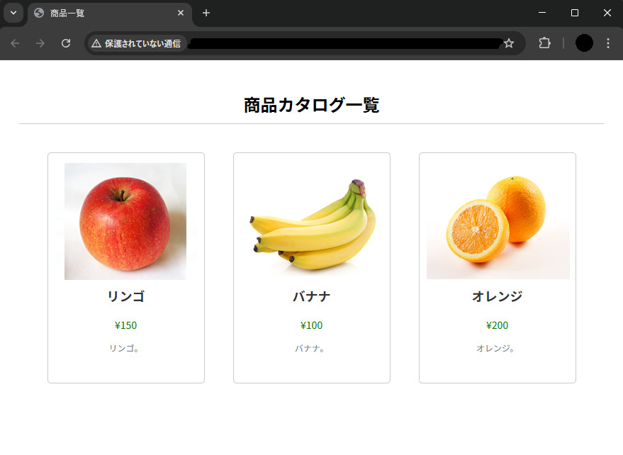
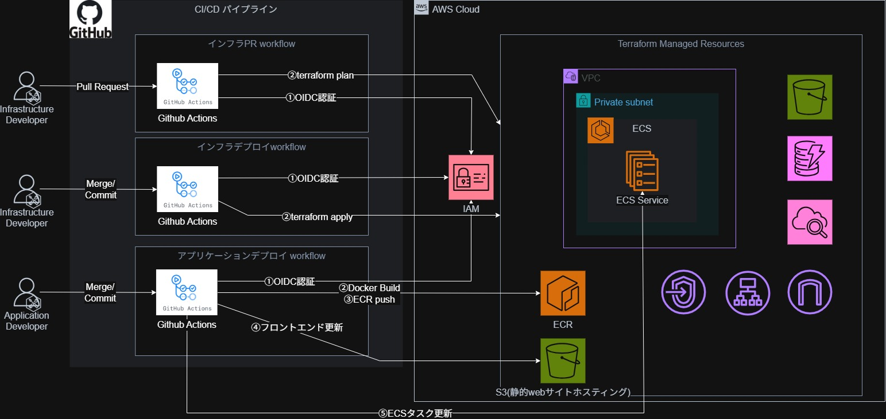

# 第1章：アーキテクチャ全体像と設計思想

本記事は、**AWS ECS（Fargate）を中心としたWebアプリケーション環境を、Terraform と CI/CD で構築する学習シリーズ**の第1章です。

ECS や Terraform、CI/CD に触れたことのある方向けの内容です。


第1章では **「なぜこの構成にしたのか」「全体として何ができるのか」** にフォーカスし、
具体的な構築手順やコードは後続章で扱います。

---

## 📚 目次

* [1. 本シリーズの目的とゴール](#1-本シリーズの目的とゴール)
* [2. アーキテクチャ全体概要](#2-アーキテクチャ全体概要)
* [3. 利用するAWSサービスと役割](#3-利用するawsサービスと役割)
* [4. データフロー](#4-データフロー)
* [5. CI/CDパイプライン概要](#5-cicdパイプライン概要)
* [6. 設計思想と技術選定の理由](#6-設計思想と技術選定の理由)
* [7. 各サービスの採用理由](#7-各サービスの採用理由)
* [8. 今後の改善点](#8-今後の改善点)
* [9. まとめ](#9-まとめ)
---
<span id="goal"></span>
## 1. 本シリーズの目的とゴール

本シリーズは **学習目的** で、最終的には、
**Webページにアクセスすると、S3 にアップロードしておいた画像と、DynamoDB に保存されたデータが表示されるシンプルなWebサイト** を作成します。

### 🖥 完成イメージ



* **フロントエンド**

  * React を用いて実装
  * ビルドした成果物を **S3 の静的Webサイトホスティング** に配置
  * ブラウザから直接アクセス可能なWebページを提供
  
  
* **バックエンド**

  * Node.jsでAPIを実装
  * **ECS（Fargate）上でコンテナとして実行**
  * フロントエンドからのリクエストを受け取り、

    * DynamoDB からデータを取得
    * S3 に保存された画像情報を取得

下記の目的・制約により、今回の構成にしました。

### 🎯 学習目標

* ECS（Fargate）を用いて **バックエンドAPIをコンテナで運用**
* フロントエンドとバックエンドを分離した **現実的なWeb構成**
* DynamoDB・S3と連携するバックエンド実装
* Terraformによる **インフラのコード化（IaC）**
* GitHub Actionsを用いた **CI/CDパイプライン構築**
* アプリケーションとインフラの **パイプライン分離**

### ⚠️ 設計上の制約

* 個人学習のため **コスト優先**
* 複雑な構成は避け、**シンプルさを優先**
* 継続的な管理やメンテナンスの工数を削減

### 📘 本シリーズの構成

本記事はシリーズとなっており、**ECS を中心としたWebアプリケーションを段階的に構築していく構成** になっています。  
今回は全8章の内の第1章です。

#### 各章の内容は以下の通りです。

* **[①構成の説明](#1-本シリーズの目的とゴール)**  
* **[②S3(静的Webサイトホスティング)/フロントエンド]()**  
* **[③VPC関連]()**  
* **[④Docker/バックエンド]()**  
* **[⑤ECS + ALB]()**  
* **[⑥DynamoDB・S3連携]()**  
* **[⑦CI/CD(アプリケーション)]()** 
* **[⑧CI/CD(インフラ)]()**

---

<span id="architecture"></span>
## 2. アーキテクチャ全体概要

本構成は、**フロントエンドとバックエンドを明確に分離**した構成です。

* **フロントエンド**
  S3 (静的Webサイトホスティング)

* **バックエンド**
  ALB + ECS Fargate 

* **データストア**
  DynamoDB（テキストデータ）  
  S3（画像などのオブジェクト）


ファルダ構成
```text
.
├── .github
│   └── workflows
│       ├── apply.yml
│       ├── applycation.yml
│       ├── destroy.yml
│       ├── infrastructure.yml
│       └── pull_request.yml
├── backend
│   ├── Dockerfile
│   ├── package-lock.json
│   ├── package.json
│   └── server.js
├── frontend
│   ├── build
│   ├── public
│   ├── src
│   ├── .env
│   ├── nginx.conf
│   ├── package-lock.json
│   └── package.json
└── terraform
    ├── envs
    ├── modules
    │   ├── alb
    │   ├── dynamodb
    │   ├── ecr
    │   ├── ecs
    │   ├── iam
    │   ├── s3
    │   ├── sg
    │   ├── vpc
    │   └── vpc_endpoint
    ├── backend.tf
    ├── main.tf
    ├── outputs.tf
    ├── variables.tf
    ├── provider.tf
    ├── terraform.tfvars.example
    └──.gitignore   
```

---
<a id="aws-services"></a>
## 3. 利用するAWSサービスと役割

### 🔧 主要サービス一覧

| サービス           | 役割                    |
| -------------- | --------------------- |
| S3             | 静的Webホスティング / ストレージ |
| ECS Fargate    | バックエンドAPI実行           |
| ALB            | 固定DNS名提供 / 負荷分散   |
| DynamoDB       | NoSQLデータベース           |
| VPC            | ネットワーク分離              |
| ECR            | コンテナイメージ保存            |

---

<span id="data-flow"></span>
## 4. データフロー

### 🌐 フロントエンドアクセス

```
ユーザー → S3（静的Webサイト）
```

### 🔁 バックエンドAPIアクセス

```
ユーザー
 → ALB
   → ECS（バックエンドAPI）
     → DynamoDB / S3
```
学習用にECSを経由してS3にアクセスする構成にしています。
実運用では CloudFront + S3 から直接配信する構成が一般的です。

---

<span id="cicd"></span>
## 5. CI/CDパイプライン概要

CI/CDには **GitHub Actions** を採用しています。



### 🚀 アプリケーション更新時

```
GitHub Push / Merge
 → GitHub Actions
   → OIDC認証
   → Docker Build
   → ECR Push
   → フロントエンド build & S3 sync
   → ECS サービス更新
```

### 🏗 インフラ更新時

```
PR作成
→ GitHub Actions
 → OIDC認証
 → terraform plan

Merge
→ GitHub Actions
 → OIDC認証
 → terraform apply
```


### CI/CD設計方針：アプリケーションとインフラの分離

本構成では、**アプリケーションとインフラでCI/CDワークフローを分離** しています。

インフラ更新時は、
**PR作成 → レビュー → Merge** の流れを前提とし、

* **PR作成時**：検証用ワークフロー（Terraform plan）
* **Merge時**：本番反映用ワークフロー（Terraform apply）

を実行する設計としています。

これにより、レビュー・承認後に Merge されたタイミングでのみ、本番反映用のワークフローを実行し、意図しないインフラ変更を防ぐ設計としています。

---

### ワークフロー分離のメリット

#### ⏱️ 実行時間・コストの最適化

アプリケーションの軽微な変更時に、
不要な Terraform 処理を実行せずに済むため、

* CI/CD の実行時間短縮
* ランナー利用時間削減によるコスト最適化

を実現できます。

---

#### 🛡️ インフラ安定性の向上

`terraform apply` の実行を
**「インフラコードが変更された場合」のみに限定** することで、インフラ更新回数の削減し、

* 意図しないインフラ変更の防止
* 破壊的操作によるリスクの低減

しています。


---

<span id="design-concept"></span>

## 6. 設計思想と技術選定の理由

### 🧠 可用性について

* 学習目的のため **最小限**
* ALB要件により **2AZ**
* ECSタスク数は **1**

※ 実運用ではECSも複数AZ構成が必須

---

### 🔐 セキュリティ設計

* Security Groupは **最小権限**
* 自分のIPのみS3, ALBへアクセス許可（学習用）
* IAMは下記のみ許可
  * ECSコンテナの起動に必要な権限（Execution Role）
  * ECSタスクロール：S3 / DynamoDB への操作を限定的に許可

---

### 📈 スケーラビリティ

* S3 & ECS Fargate による高い拡張性
* CloudFrontは今回は未導入（後続で解説）

---

### 💰 コスト最適化

* VPCエンドポイント(Interface型)を介したコンテナイメージのpull
* S3による静的コンテンツ配信
* ECS Fargate採用によりアイドル状態のインスタンス料金削減
* DynamoDB（オンデマンドモード）採用による、リクエスト数に応じたコスト最適化
* 無料で利用できるCI/CDツールのGithub Actions採用

---

<span id="reasoning"></span>
## 7. 各サービスの採用理由

本構成では、「**学習目的・低コスト・運用負荷の最小化**」を重視し、各AWSサービスを選定しています。
ここでは、それぞれのサービスを **なぜ採用したのか** を整理します。

---

### 🪣 S3（静的Webサイトホスティング）

#### 1. サーバーレスによる運用負荷の低減

S3はフルマネージドなオブジェクトストレージであり、

* サーバーOS管理
* セキュリティパッチ適用
* ハードウェア障害対応

といった **インフラ運用が一切不要** 。  
また、99.99%の可用性、11ナインの耐久性が保証されており、
ユーザー側で冗長構成を設計する必要がない。

#### 2. コスト削減

* **アイドルコストがゼロ**

  * EC2 や Fargate のように、アクセスがなくても料金が発生することがない
* **従量課金のみ**

  * 保存容量とリクエスト数に応じた課金


※ 今回は学習テーマから外れるため CloudFront は未導入としています。

---

### 🐳 ECS Fargate（バックエンドAPI）

本構成では、学習目的として **ECS（Fargate）** を採用しています。  
EC2およびLambdaと比較した際に、学習面でのメリットが大きいためです。

#### 1. EC2との比較

Fargateは **EC2を管理せずに利用できるサーバーレスなコンテナ実行環境** です。  
EC2（または ECS on EC2）と比較して、以下のメリットがあります。

**① 運用負荷の低減**
* OS管理・パッチ適用が不要
* クラスターのキャパシティ設計・管理が不要

**② コスト面のメリット**
* コンテナ実行中のみ課金（CPU / メモリ単位）
* アイドル状態のインスタンス料金が発生しない

#### 2. Lambdaとの比較

LambdaではなくFargateを選択した主な理由は以下です。

**① 実行制約の少なさと性能の安定性**
* Lambdaのような実行時間制限がない
* CPU / メモリを事前に確保でき、性能が予測しやすい

**② コンテナ技術の活用と移植性**
* Dockerコンテナをそのまま実行可能
* 既存コンテナ資産の再利用や環境差異の排除が容易


---

### ⚖️ ALB（Application Load Balancer）

バックエンドAPIの公開には **ALB** を採用しています。

#### 1. 固定DNS名の提供

ECSタスクは起動・停止のたびに、

* IPアドレス
* ポート番号

が動的に変化します。
フロントエンド側でこれを追跡することはできません。

ALBを利用することで、

* **固定のDNS名**
* 内部での動的IP抽象化

が実現され、フロントエンドは常に同じエンドポイントへアクセスできます。

NLB + API Gateway でも代替可能ですが、
今回は **構成のシンプルさ** を優先して ALB を採用しました。

---

### 🗄 S3（オブジェクトストレージ）

画像などのオブジェクト保存先として S3 を採用しています。

* 非常に安価
* 高い耐久性
* スケーラビリティを意識せず利用可能

学習のため、ECSを経由して画像を取得する構成にしています。

---

### 📦 DynamoDB
本構成では複雑なデータ構造を必要としないため、  
バックエンドのデータストアとして **DynamoDB** を採用しています。

#### 1. アイドルコストゼロのサーバーレスDB

* 利用した分だけ課金される従量課金モデル
* インスタンス管理が不要
* オンデマンドモードにより負荷変動にも自動対応

#### 2. ネットワーク設計を簡素化できる

* DB自体はVPC外のマネージドサービス
* サブネットやセキュリティグループの設計が不要

---

### 🌐 VPC・ネットワーク設計

ECS・ALBを利用するために、VPCを構築しています。

* ECSタスクは **プライベートサブネット**
* ALBは **パブリックサブネット**

#### VPCエンドポイント採用理由

ECSタスクをプライベートサブネットに配置しているため、  
以下の通信は **VPCエンドポイント経由** としています。

* S3 / DynamoDB：Gateway型
* ECR / CloudWatch：Interface型

これにより、NAT Gatewayが不要となり、

* 通信コストの削減
* インターネットを経由しないことによるセキュリティ向上

を実現しています。


---

### 🔄 GitHub Actions（CI/CD）

CI/CDには **GitHub Actions** を採用しています。

#### 採用理由

* 無料利用可能
* YAML定義がシンプルで学習しやすい
* サーバー管理不要
* GitHubとの高い親和性

OIDC連携により、AWSアクセスキーをSecretsに保存せずに済む点もメリットです。

---

### 🔐 HTTPSをあえて未採用とした理由

本構成では HTTPS を未使用としています。

* 学習環境で第三者アクセスがない
* 主目的は ECS / IaC / CI/CD の理解
* 工数・コスト削減を優先

HTTPS化（ACM + ALB / S3）は、
次回以降の記事で改めて解説・実装予定です。


---

<span id="future-improvements"></span>
## 8. 今後の改善点

本構成は学習目的として最小構成を優先していますが、
実運用を想定した場合には、以下の改善が考えられます。

* CloudFront の導入
* Route 53 + 独自ドメインの利用
* HTTPS 化（ACM）
* WAF によるセキュリティ強化
* Cognito による認証機構の追加
* ECS / ALB のマルチ AZ 構成

---

### ☁️ CloudFront の導入

現在は S3 の静的 Web サイトホスティングから直接フロントエンドを配信していますが、
CloudFront（CDN）を導入することで、配信性能とセキュリティの両面を強化できます。

#### 改善内容

CloudFront を導入し、S3 をオリジンとして設定します。
ユーザーからのアクセスはすべて CloudFront 経由とし、
OAI（または OAC）を利用して S3 への直接アクセスを禁止します。

#### 期待される効果

* **配信高速化（レイテンシ低減）**
  世界中のエッジロケーションにコンテンツをキャッシュし、
  ユーザーに最も近い地点から配信することで表示速度が向上します。
* **セキュリティ向上**
  S3 への直アクセスを遮断でき、HTTPS 化や WAF 導入の前提となります。
* **耐障害性・耐負荷性の向上**
  アクセス集中時にも CloudFront がトラフィックを分散・吸収し、
  オリジン（S3 や ALB）への負荷を軽減します。

---

### 🔒 HTTPS 化（ACM による証明書発行）

現状では HTTP 通信（平文）を使用していますが、
実運用を想定する場合、HTTPS 化は必須要件となります。

#### 改善内容

AWS Certificate Manager（ACM）を利用して SSL/TLS 証明書を無料で発行し、
ALB および CloudFront に適用します。

#### 期待される効果

* **通信の暗号化**
  クライアントとサーバー間の通信を暗号化し、
  盗聴や改ざんのリスクを防止します。
* **Web サイトの信頼性向上**
  ブラウザに「安全な接続」と表示され、ユーザーに安心感を与えます。

---

### 🌐 独自ドメインの取得・管理（Route 53）

現在は ALB や S3 が提供する AWS 固有のエンドポイント URL を利用していますが、
独自ドメインを利用することで、利便性と運用性が向上します。

#### 改善内容

Route 53 で独自ドメインを取得・管理し、
CloudFront や ALB にカスタムドメインを割り当てます。

#### 期待される効果

* **ユーザビリティ向上**
  覚えやすい URL（例：`https://api.example.com`）でサービスを提供できます。
* **構成変更への耐性**
  Route 53 のエイリアスレコードを利用することで、
  ALB や CloudFront を再構築しても、DNS 設定のみで対応可能です。
* **証明書管理との親和性**
  ACM による証明書発行・管理と組み合わせやすくなります。

---

### 🛡️ WAF によるセキュリティ強化

現在のセキュリティ対策はセキュリティグループによる
ポート・IP 制御が中心となっています。

#### 改善内容

AWS WAF を CloudFront または ALB の前段に配置し、
アプリケーションレベルの攻撃対策を実装します。

#### 期待される効果

* **Web アプリケーション攻撃対策**
  SQL インジェクションや XSS などの攻撃を防ぐことができます。
* **レート制限による不正アクセス防止**
  ブルートフォース攻撃や過剰なリクエストを検知・遮断できます。
* **ボット対策**
  悪意のあるクローラーによるリソース消費を抑制できます。

---

### 🔐 Cognito による認証・認可機構の追加

現状の構成では、バックエンド API は **認証なしでアクセス可能** な状態となっています。


#### 改善内容

ALB + ECS のバックエンド API に対して、
Cognito を用いた認証・認可を追加します。


#### 期待される効果

* 自前でログイン機構やパスワード管理を実装する必要がなくなります
* 認証なし API への不正アクセスを防止できます。

---


### 🔁 マルチ AZ 構成（ECS タスクの冗長化）

現状はコスト最優先のため、ECS サービスのタスク数を 1 に設定しています。

#### 改善内容

ECS サービスのタスク数を 2 以上に増やし、
複数のアベイラビリティゾーン（AZ）に分散配置します。

#### 期待される効果

* **高可用性の確保**
  特定の AZ 障害時でも、他の AZ のタスクが処理を継続できます。
* **ゼロダウンタイムデプロイ**
  サービス停止なしでデプロイが可能になります。


---

<span id="summary"></span>
## 9. まとめ

本章では、
**「なぜこの構成なのか」「何ができるのか」** を整理しました。

次章以降では、

* S3によるフロントエンド構築
* VPC設計
* Docker & ECS
* CI/CD実装

について構築方法など詳細を解説していきます。

* **[①構成の説明](#1-本シリーズの目的とゴール)**  
* **[②S3(静的Webサイトホスティング)/フロントエンド]()**  
* **[③VPC関連]()**  
* **[④Docker/バックエンド]()**  
* **[⑤ECS + ALB]()**  
* **[⑥DynamoDB・S3連携]()**  
* **[⑦CI/CD]()** 
