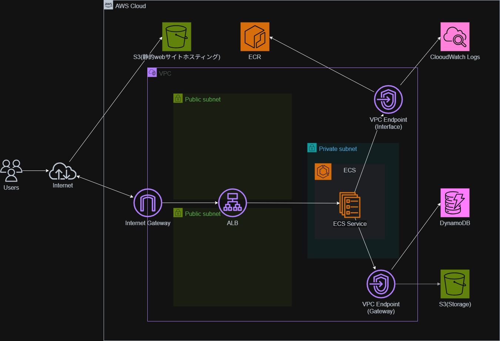

# 第2章：S3（静的Webサイトホスティング）／フロントエンド

本章では、フロントエンドを **S3 の静的Webサイトホスティング** として構築する部分について解説します。
本シリーズは AWS 環境構築を主目的としているため、React アプリケーションの詳細な実装には踏み込まず、**インフラ視点での構成・設定意図** を中心に説明します。


## 📚 目次

* [1. 構成の説明](#1-構成の説明)
* [2. 作成方法](#2-作成方法)
* [3. Terraform構成](#3-terraform構成)
* [4. 振り返り](#4-振り返り)
* [5. 参照](#5-参照)
* [6. コード全体](#6-コード全体)

---

## 1. 構成の説明

### 何をしたいか

* React で実装したフロントエンドをブラウザから直接アクセス可能にする
* バックエンド（ECS）とは分離し、**フロントエンドは S3 で完結**させる
* 後続章で構築する API を呼び出し、データを表示できる状態にする

---

### どんな構成か・何ができるか

* フロントエンド成果物を **S3 バケットに配置**
* S3 の **静的Webサイトホスティング機能** を利用して公開
* ブラウザから直接アクセス可能な Web ページを提供
* JavaScript からバックエンド API を呼び出す構成



構成全体については[第一章]()参照。

---

## 2. 作成方法

### 前提条件

* AWS アカウント
* Terraform 実行環境
* React アプリケーションのビルド成果物（`index.html` など）

※ React の開発手順やビルド方法の詳細は本章では扱いません。

---

### 構築順序（概要）

1. S3 バケット作成
2. 静的Webサイトホスティング有効化
3. アクセス制御（バケットポリシー）
4. フロントエンド成果物配置

---

### 主要な設定ポイント

* **静的Webサイトホスティング**

  * `index.html` をエントリポイントとして設定
* **バケットポリシー**

  * 読み取りのみ許可

---

## 3. Terraform構成

### フォルダ構成

```text
terraform/
├──modules/S3/
│          ├──main.tf
│          ├──variables.tf
│          └──outputs.tf
├── main.tf
├── variables.tf
├── outputs.tf

```

---

### 主要な Terraform リソース

#### S3 バケット作成

* フロントエンド配置用の S3 バケット
* `force_destroy = true` を設定し、学習環境での削除を容易に
※実運用では非推奨

```hcl
resource "aws_s3_bucket" "web_bucket" {
  bucket = var.web_bucket_name
  force_destroy = true
}
```

---

#### 静的Webサイトホスティング設定

```hcl
resource "aws_s3_bucket_website_configuration" "web_bucket_website" {
  bucket = aws_s3_bucket.web_bucket.id

  index_document {
    suffix = "index.html"
  }

  error_document {
    key = "error.html"
  }
}
```

* S3 を Web サーバーとして利用
* index_document: 通常時に表示するデフォルトのページを指定
* error_document: エラーが発生した際に表示するページを指定
---

#### セキュリティ設定

* **暗号化**：SSE-S3（AES256）
* **バージョニング**：無効化（学習用途）

* バケットポリシー
学習用途のため、自分のIPアドレスからのアクセスのみ許可。
```hcl
resource "aws_s3_bucket_policy" "web_bucket_policy" {
  bucket = aws_s3_bucket.web_bucket.id
  policy = jsonencode({
    Version = "2012-10-17",
    Statement = [
      {
        Sid       = "AllowIPAccessForStaticWebsite",
        Effect    = "Allow",
        Principal = "*",
        Action    = "s3:GetObject",
        Resource  = "${aws_s3_bucket.web_bucket.arn}/*",
        Condition = {
          IpAddress = {
            "aws:SourceIp" = var.web_bucket_access_ip_cidr
          }
        }
      }
    ]
  })
}
```
  * Public Access Block はポリシー利用を許可
```hcl
resource "aws_s3_bucket_public_access_block" "public_access_block" {
  bucket = aws_s3_bucket.web_bucket.id

  block_public_acls   = true
  block_public_policy = false
  ignore_public_acls  = false
  restrict_public_buckets = false
}
```
| 項目 | 設定値 | 意味と影響 |
| --- | --- | --- |
| **`block_public_acls`** | `true` | **【有効】** 個別のファイル（オブジェクト）に対して「公開」というACLを設定することを禁止。 |
| **`block_public_policy`** | `false` | **【無効】** **バケットポリシーによる公開設定を許可。** これを `true` にすると、ウェブサイトとして公開できない。 |
| **`ignore_public_acls`** | `false` | **【無効】** 既存の公開ACLを無視しない。（今回は上の設定でACLを禁止しているので、実質的にあまり影響しない）。 |
| **`restrict_public_buckets`** | `false` | **【無効】** 公開ポリシーを持つバケットへのアクセス制限をかけない。 |


---

### フロントエンドコードについて（概要のみ）

* React で実装した SPA
* 環境変数から API エンドポイントを取得
* バックエンド API から取得したデータを一覧表示

本章では、
**「S3 に配置された静的ファイルが API と連携できる」**
という点のみ押さえています。

---

## 4. 振り返り

### 改善できそうな点

* CloudFront の導入
* HTTPS 化

改善点の詳細は[第一章]()参照。

---

### 次にやること

次章では、
[**VPC・サブネット・セキュリティグループ** を中心とした
ネットワーク構成]()について解説します。

* **[①構成の説明]()**  
* **[②S3(静的Webサイトホスティング)/フロントエンド]()**  
* **[③VPC関連]()**  
* **[④Docker/バックエンド]()**  
* **[⑤ECS + ALB]()**  
* **[⑥DynamoDB・S3連携]()**  
* **[⑦CI/CD(アプリケーション)]()** 
* **[⑧CI/CD(インフラ)]()**

---

## 5. 参照

* [AWS公式ドキュメント（S3 静的Webサイトホスティング）](https://docs.aws.amazon.com/ja_jp/AmazonS3/latest/userguide/WebsiteHosting.html)
* [Terraform AWS Provider ドキュメント](https://registry.terraform.io/providers/hashicorp/aws/latest/docs)

---

## 6. コード全体

terraform/modules/s3/variable.tf

```hcl
variable "web_bucket_name" {
  description = "Name of the S3 bucket for static website hosting"
  type        = string
}

variable "storage_bucket_name" {
  description = "Name of the S3 bucket for storage"
  type        = string
}

variable "web_bucket_access_ip_cidr" {
  description = "CIDR block for S3 web bucket access policy"
  type        = string
}

variable "environment" {
  description = "Environment tag"
  type        = string
}
```
terraform/modules/s3/main.tf
```hcl
resource "aws_s3_bucket" "web_bucket" {
  bucket = var.web_bucket_name

  force_destroy = true
  
  tags = {
    Name        = var.web_bucket_name
    Environment = var.environment
  }
}

resource "aws_s3_bucket_versioning" "web_bucket_versioning" {
  bucket = aws_s3_bucket.web_bucket.id

  versioning_configuration {
    status = "Suspended"
  }
}

resource "aws_s3_bucket_server_side_encryption_configuration" "web_bucket_sse" {
  bucket = aws_s3_bucket.web_bucket.id

  rule {
    apply_server_side_encryption_by_default {
      sse_algorithm = "AES256"
    }
  }
}

resource "aws_s3_bucket_website_configuration" "web_bucket_website" {
  bucket = aws_s3_bucket.web_bucket.id

  index_document {
    suffix = "index.html"
  }

  error_document {
    key = "error.html"
  }
}


resource "aws_s3_bucket_policy" "web_bucket_policy" {
  bucket = aws_s3_bucket.web_bucket.id
  policy = jsonencode({
    Version = "2012-10-17",
    Statement = [
      {
        Sid       = "AllowIPAccessForStaticWebsite",
        Effect    = "Allow",
        Principal = "*",
        Action    = "s3:GetObject",
        Resource  = "${aws_s3_bucket.web_bucket.arn}/*",
        Condition = {
          IpAddress = {
            "aws:SourceIp" = var.web_bucket_access_ip_cidr
          }
        }
      }
    ]
  })
}

resource "aws_s3_bucket_public_access_block" "public_access_block" {
  bucket = aws_s3_bucket.web_bucket.id

  block_public_acls   = true
  block_public_policy = false
  ignore_public_acls  = false
  restrict_public_buckets = false
}

```
terraform/modules/s3/outputs.tf
```hcl
output "web_bucket_arn" {
  description = "ARN of the S3 web bucket"
  value       = aws_s3_bucket.web_bucket.arn
}

output "web_bucket_name" { 
  value = aws_s3_bucket.web_bucket.bucket
}

output "web_bucket_website_endpoint" {
  value = aws_s3_bucket_website_configuration.web_bucket_website.website_endpoint
}

```
frontend/public/index.html
```html
<!DOCTYPE html>
<html lang="ja">
  <head>
    <meta charset="utf-8" />
    <meta name="viewport" content="width=device-width, initial-scale=1" />
    <title>商品一覧</title>
  </head>
  <body>
    <noscript>このアプリを使用するにはJavaScriptを有効にしてください。</noscript>
    <div id="root"></div>
  </body>
</html>
```
frontend/src/App.js
```js
import React, { useEffect, useState } from 'react';

// 【ItemCard コンポーネント】
// シンプルなインラインCSSでカードを構成
const ItemCard = ({ item }) => {
    // 説明文のスタイル
    const descriptionStyle = {
        fontSize: '0.75rem',
        color: '#6b7280',
        marginTop: '0.25rem',
        overflow: 'hidden',
        height: '2.25rem', // 2行分の高さを固定（line-clampの代替）
    };

    return (
        // カード全体のスタイル: 幅、マージン、中央寄せ、枠線
        <div key={item.id} style={{
            margin: '20px', 
            padding: '10px',
            border: '1px solid #ccc',
            borderRadius: '5px',
            width: '200px',
            textAlign: 'center',
            backgroundColor: '#fff',
        }}>
            
            {/* 画像コンテナ: 幅、高さ固定 */}
            <div style={{
                width: '100%',
                height: '160px',
                marginBottom: '10px',
                overflow: 'hidden',
            }}>
                  { e.target.onerror = null; e.target.src = "https://placehold.co/200x160/cccccc/333333?text=Image+Load+Error" }}
                 />
            </div>
            
            {/* タイトル */}
            <h3 style={{
                fontSize: '1.125rem',
                fontWeight: '600',
                color: '#333',
                overflow: 'hidden',
                whiteSpace: 'nowrap',
                textOverflow: 'ellipsis',
            }}>{item.title || 'タイトルなし'}</h3>
            
            {/* 価格 */}
            {item.price && <p style={{
                fontSize: '0.875rem',
                color: 'green',
            }}>¥{item.price.toLocaleString()}</p>}
            
            {/* 説明文 */}
            {item.description && <p style={descriptionStyle}>{item.description}</p>}
        </div>
    );
};


const App = () => {
    const [items, setItems] = useState([]);
    const [error, setError] = useState(null);
    const [isLoading, setIsLoading] = useState(true);

    useEffect(() => {
        const fetchItems = async () => {
            let API_BASE_URL = process.env.REACT_APP_API_URL;
            
            // ⭐ 堅牢性の向上: URLの末尾の '/' を除去
            if (API_BASE_URL && API_BASE_URL.endsWith('/')) {
                API_BASE_URL = API_BASE_URL.slice(0, -1);
            }
            
            // DEBUG: API_BASE_URL の値の最終確認
            console.log("DEBUG: 最終的な API_BASE_URL:", API_BASE_URL);

            if (!API_BASE_URL || API_BASE_URL === 'http:' || API_BASE_URL === 'http:/') {
                const debugMessage = "API_BASE_URLが正しく設定されていません。現在の値: " + (API_BASE_URL || "未定義");
                setError(debugMessage);
                setIsLoading(false);
                console.error("致命的な設定エラー:", debugMessage);
                return;
            }

            try {
                // 1. データ取得
                const res = await fetch(`${API_BASE_URL}/data`);
                if (!res.ok) throw new Error(`データ取得に失敗しました: ${res.status}`);
                const data = await res.json();
                
                // 2. 画像URL取得を並行処理
                const withImages = await Promise.all(data.map(async item => {
                    if (!item.image_key) return { ...item, imageUrl: null };

                    try {
                        const imgRes = await fetch(`${API_BASE_URL}/image/${item.image_key}`);
                        if (!imgRes.ok) throw new Error('画像URL取得失敗');
                        const { url } = await imgRes.json();
                        return { ...item, imageUrl: url };
                    } catch (err) {
                        console.error("画像取得エラー:", err);
                        return { ...item, imageUrl: null };
                    }
                }));

                setItems(withImages);
            } catch (err) {
                console.error("データ読み込み全体のエラー:", err);
                setError(`データ読み込みに失敗しました: ${err.message}`);
            } finally {
                setIsLoading(false);
            }
        };

        fetchItems();
    }, []);

    // DynamoDBの属性として "title" を使用し、画像URLが存在するアイテムのみフィルタリング
    const filteredItems = items.filter(item => item.title && item.imageUrl); 

    return (
        // 全体を中央寄せ
        <div style={{ textAlign: 'center', padding: '20px' }}>
            
            <header style={{ marginBottom: '20px' }}>
                <h1 style={{ 
                    fontSize: '24px', 
                    fontWeight: 'bold', 
                    borderBottom: '1px solid #ccc', 
                    paddingBottom: '10px' 
                }}>商品カタログ一覧</h1>
            </header>

            {/* エラー表示 */}
            {error && <p style={{ color: 'red', margin: '20px 0' }}>{error}</p>}
            
            {/* ⭐ 修正: ローディング中は isLoading を確認 */}
            {isLoading && !error && (
                 <p style={{ color: '#666' }}>データを読み込み中...</p>
            )}

            {/* データなし表示 */}
            {!isLoading && filteredItems.length === 0 && !error && (
                <p style={{ color: '#666' }}>表示できる商品がありません。DynamoDBにデータが存在し、S3に画像がアップロードされているか確認してください。</p>
            )}

            {/* 商品カードのコンテナ (Flexboxで中央寄せ) */}
            <div style={{
                display: 'flex', 
                flexWrap: 'wrap', 
                justifyContent: 'center', 
                maxWidth: '1200px',
                margin: '0 auto',
            }}>
                {/* ItemCardを使用 */}
                {filteredItems.map(item => (
                    <ItemCard key={item.id} item={item} />
                ))}
            </div>
        </div>
    );
}

export default App;
```